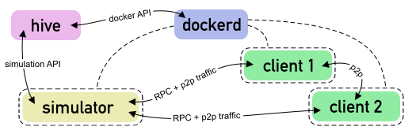

## What is Hive?

Hive is a system for running integration tests against Ethereum clients.

In hive, integration tests are called 'simulations'. A simulation is controlled by a
program (the 'simulator') written in any language. The simulator launches clients and
contains test logic. It reports test results back to hive, where they are aggregated for
display in a web browser.

What makes hive different from other, generic CI infrastructure is the tight integration
of Ethereum clients and their features. Simulator programs usually don't need to care
about the differences between client implementations because hive provides a common
interface to launch and configure them all. At this time, clients can be configured for
any Ethereum 1 network definition, i.e. genesis block and hard fork activation block
numbers. Simulations can also instruct clients to load a pre-defined test chain and enable
block mining. You can find more information about client configuration in the [client
documentation].

Ethereum Foundation operates a public instance of Hive to check for consensus
compatibility, peer-to-peer networking spec compliance, and user API support for most
Ethereum client implementations. You can find the latest test results at
<https://hivetests.ethdevops.io/>.

## Overview of currently implemented simulators

This is an overview of some of the simulators which are currently implemented and running
continuously on the production hive instance:

- `devp2p/eth`, `devp2p/discv4`: These simulators run the 'eth' peer-to-peer protocol
  tests and Discovery v4 protocol tests. The test suites themselves are maintained in the
  go-ethereum repository. In their hive adaptation, the simulator launches the client with
  a known test chain, obtains its peer-to-peer endpoint (the `enode://` URL) and sends
  protocol messages to it. The client's responses are analyzed by the test suite to ensure
  that they conform to the respective protocol specification.

- `ethereum/sync`: This simulator attempts to synchronize the blockchain among all
  clients. For each enabled client implementation, it creates one instance of the client
  as the 'source'. The 'source' client is initialized with a known test chain. The
  simulator then launches a 'sink' instance of every known client against the source and
  checks whether the sink can synchronize the chain from the source client.

- `ethereum/consensus`: This simulator runs the Ethereum 1 consensus tests against all
  clients. While client implementers are generally expected to run these tests themselves,
  they might not always run the latest tests, and may skip some of them if they take too
  long. Running these tests in a hive simulation ensures that none are skipped.

- `ethereum/rpc`: The RPC simulator configures a client for clique PoA mining and runs
  various tests against the web3 JSON-RPC interface. These tests ensure that the client is
  able to receive transactions via RPC, incorporate them into its chain, and report
  transaction results via the standard APIs.

- `ethereum/graphql`: This simulator initializes a client with a known test chain and
  enables the GraphQL API endpoint. It then performs certain queries and compares their
  output to known good outputs.

## How it works

This section explains how a single simulation run works.

For a single run, the user provides the name of the simulator to run, and a set of client
names to run against. For example:

    ./hive --sim ethereum/sync --client go-ethereum,besu,openethereum --results-root ./workspace/logs

Hive first builds simulator and client images using docker. It expects a Dockerfile in the
`./simulators/ethereum/sync` directory as well as a Dockerfile for each client (in
`./clients/*/Dockerfile`).

While the simulator build must always work without error, it's OK for some client builds
to fail as long as one of them succeeds. This is because client code pulled from the
respective upstream repositories may occasionally fail to build.

Once all images are built, the simulator program is launched in a docker container. The
`HIVE_SIMULATOR` environment variable contains the HTTP server URL of the hive controller.
The [hive simulation API] can be accessed at this URL. The simulator launches clients and
reports test results through the API.

When the simulator requests a client instance, the hive controller launches a new docker
container using the built client image. The client container entry point receives
configuration through environment variables and files provided by the simulator. Depending
on this configuration data, the client entry point configures the client's genesis state
and imports the test chain (if provided). The client is now expected to launch its network
endpoints for RPC and p2p communication.

When the client has finished starting, the simulator program communicates with it on the
RPC and p2p endpoints. More than one client may be launched, and the clients can also
communicate with each other.

During the simulation run, information about 'test suites' and their test cases must be
provided by the simulator via the simulation API. The hive controller collects this
information in a JSON file. It also collects client logs as well as the output of the
simulator program. All files are written to the results directory (`./workspace/logs`).

When the simulator program exits, the simulator container and all client containers are
stopped and removed. The `hive` command then exits as well.

## Viewing simulation results (hiveview)

The output of a single simulation run is a JSON file containing test results, and several
log files containing the output of the simulator and clients.

To view the test results and logs in a web browser, use the `hiveview` tool:

    ./hiveview --serve --logdir ./workspace/logs

This tool runs a web interface on <http://127.0.0.1:8080>. The interface shows information
about all simulation runs for which information was collected.
